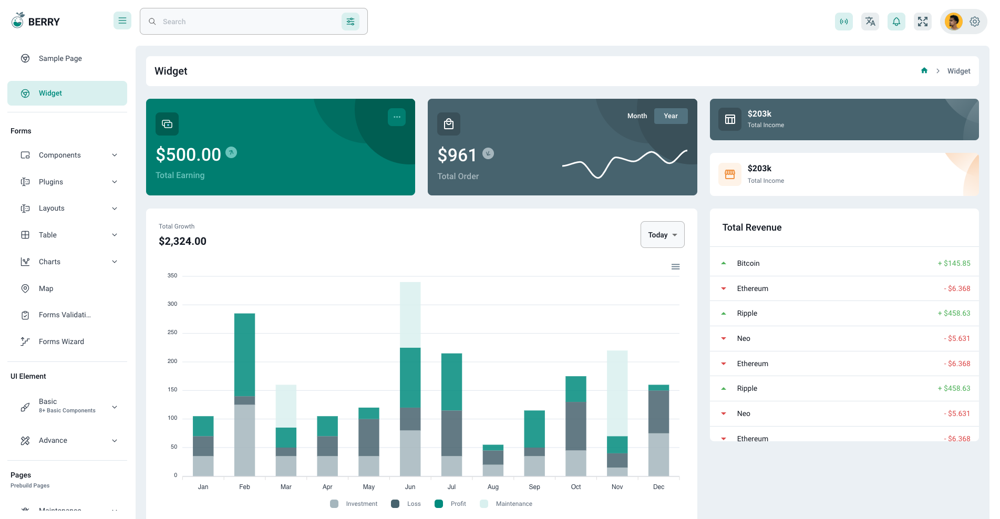
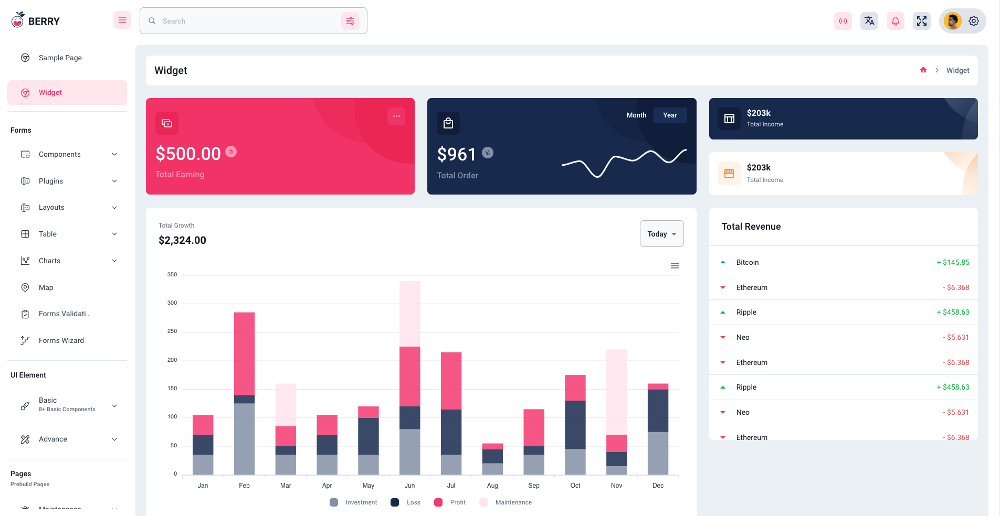
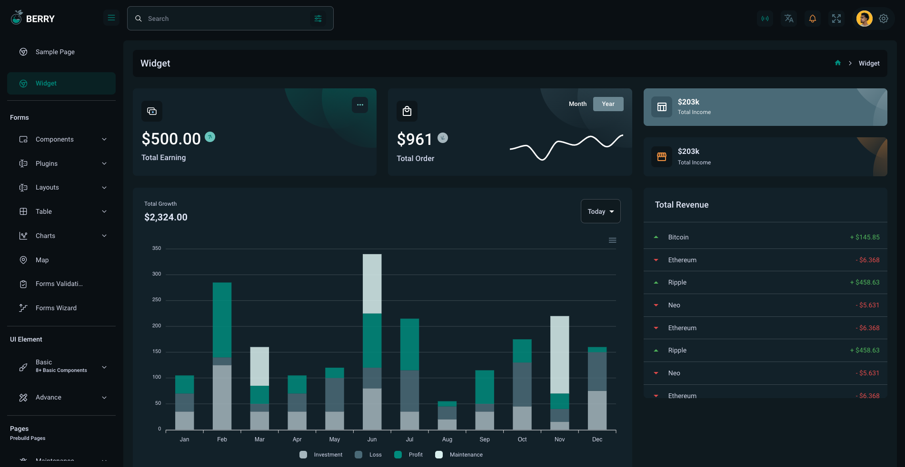
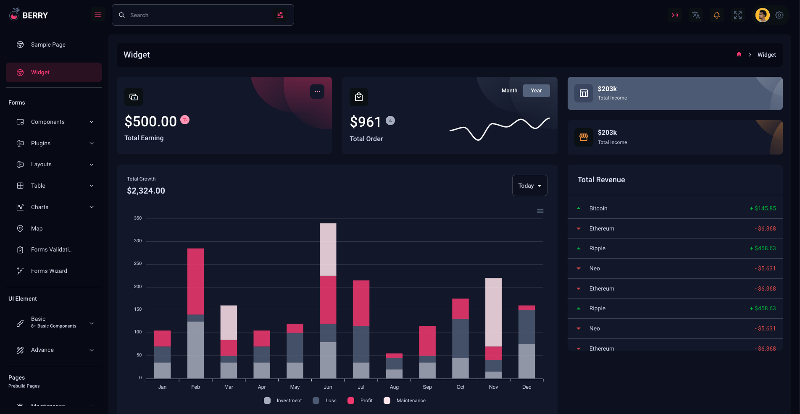

# Themes

This template comes with a number of preset colours and with Dark/Light theme support.

# Dark and Light theme

Navigate to [config.js](./../src/config.js)
The ThemeMode enum has 2 modes for dark and light theme:

```
export const ThemeMode = {
    LIGHT: 'light',
    DARK: 'dark'
};
```

Modify the default config export attribute `mode` to either `ThemeMode.DARK` or `ThemeMode.LIGHT`:

```
const config = {
    ...
    mode: ThemeMode.LIGHT, 
    ...
};
```


# Colour Presets

Navigate to [config.js](./../src/config.js)
The Presets enum has seven preset colours:

```
export const Presets = {
    theme0: "default",
    theme1 : "theme1",
    theme2 : "theme2",
    theme3 : "theme3",
    theme4 : "theme4",
    theme5 : "theme5",
    theme6 : "theme6",
}
```

Modify the default config export attribute `presetColor` to one of the seven preset colours to change the preset colour (example for theme1 below):

```
const config = {
    ...
    presetColor: Presets.theme1, 
    ...
};
```


# Screenshots

##### Theme 1 Light



#### Theme 2 Light



#### Theme 1 Dark



#### Theme 2 Dark

